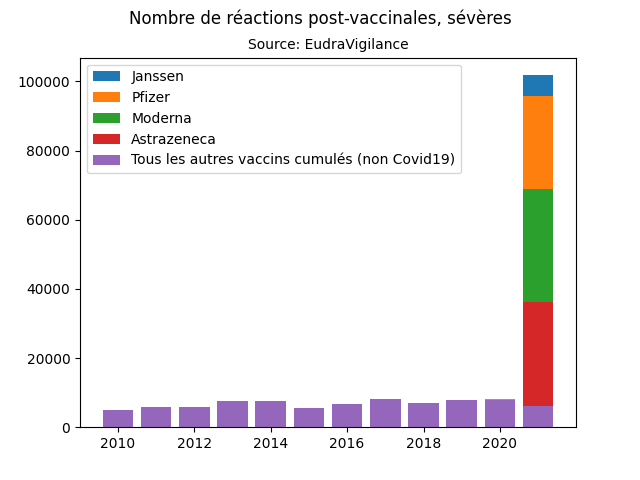
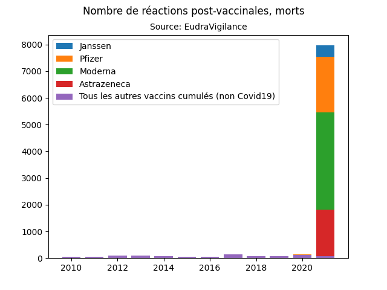

# c19vaxcheck

Programme pour extraire les données de la pharmacovigilance [EudraVigilance](https://www.adrreports.eu/en/search_subst.html), et pouvoir les examiner.

## Results: Réactions vaccins Covid19 VS vaccins non-Covid19

Ces résultats sont des cumuls de toutes les réactions sévères survenues suite à TOUS les vaccins (Covid19 VS les autres), stockées dans la bases de données d'EudraVigilance.

On peut observer une amplitude bien plus importante pour les vaccins Covid19, suggérant une toxicité bien plus importante que les vaccins traditionnels.






## How to use

* Install [Python](https://www.python.org)
* Install [Firefox](https://www.mozilla.org/fr/firefox/new/)
* Install [geckodriver](https://github.com/mozilla/geckodriver/releases)

```
pip install -r requirements.txt
./run.py all
```